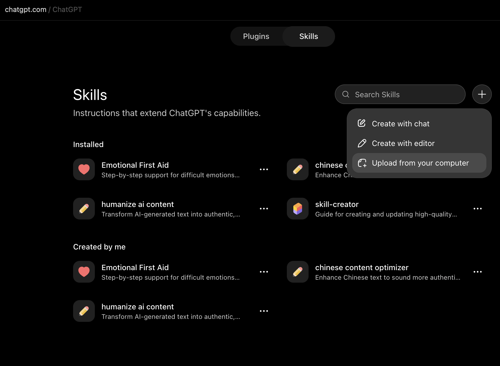

# Seedance Prompt Forge

Write, audit, and optimize prompts for **Seedance 2.5 with Seedance Prompt Forge**, ByteDance's video generation model.

Give Seedance Prompt Forge a rough brief and it names every subject, binds each reference
image, video, and audio clip to the thing it defines, applies the template for your task type,
and runs a deterministic linter over the draft before you spend a generation on it.

Paste a generation that came out wrong and it works backwards. Swapped characters, identity
or clothing drift, backgrounds leaking out of reference images, every reference appearing at
once, events skipped or rushed, dialogue in the wrong language; each symptom maps to one
smallest fix rather than a rewrite.

Covers text-to-video, multi-reference generation, 30-second multi-stage videos, video editing,
forward and backward extension, first/last frame and multi-keyframe sequences, storyboard
grids, blockout re-rendering, one-click video, and seamless transitions.

Built as an [Agent Skill](https://agentskills.io), so it runs unmodified in Claude Code,
Claude Cowork, Codex CLI, Cursor, Cline, GitHub Copilot, and Gemini CLI; plus a single-file
build for ChatGPT and other chat-only surfaces.

## Add the skill in a browser (chatgpt.com, claude.ai)

Browser chat apps can't clone a repository, so they install the skill from a file.
Download `dist/seedance-prompt-forge.zip` — it contains the `seedance-prompt-forge/`
skill folder at the archive root, as these apps expect.

**chatgpt.com**

1. Download `dist/seedance-prompt-forge.zip`.
2. Open **Settings → Plugins → Browse plugins → Skills**, click the **+** sign, and select
   **Upload from your computer** — or go to <https://chatgpt.com/skills> and upload.
3. Select the ZIP and confirm the upload.



**claude.ai**

1. Download `dist/seedance-prompt-forge.zip`.
2. Go to **Settings → Skills** (also labelled **Customize → Skills**).
3. Click **+ → Create skill → Upload a skill** and select the ZIP.
4. Toggle the skill on and start a new chat.

## Install

The repository root is the skill directory, so cloning it into an agent's skills path is a
complete install.

**One agent:**

```bash
git clone https://github.com/silentbuilds/seedance-prompt-forge \
  ~/.claude/skills/seedance-prompt-forge     # Claude Code, Claude Cowork
```

Swap the path for your agent:

| Agent | Personal | Project |
|---|---|---|
| Claude Code / Cowork | `~/.claude/skills/` | `.claude/skills/` |
| Codex CLI | `~/.codex/skills/` | `.codex/skills/` |
| Cursor | — | `.cursor/skills/` |
| GitHub Copilot | — | `.github/skills/` |
| Gemini CLI | `~/.gemini/skills/` | `.gemini/skills/` |
| Cline, Amp, OpenCode, Warp, Antigravity | — | `.agents/skills/` |

`.agents/skills/` is the vendor-neutral path that several agents read; it is the safest choice
for a skill committed to a shared repo.

**Several agents at once:**

```bash
git clone https://github.com/silentbuilds/seedance-prompt-forge && cd seedance-prompt-forge
./scripts/install.sh              # every agent detected on this machine
./scripts/install.sh claude codex # or name them
./scripts/install.sh --project    # into this project, all neutral + vendor paths
./scripts/install.sh --list       # show paths without writing anything
```

Start a new session afterwards — skills are discovered at startup.

## Verify it loaded

Ask your agent: *"Do you have a skill for Seedance prompts?"* Or in Claude Code and Copilot,
type `/` and look for it in the list.

## The linter

`scripts/lint_prompt.py` checks the mechanically checkable half of the pre-submission
checklist. No dependencies, Python 3.8+.

```bash
python3 scripts/lint_prompt.py my-prompt.txt --task edit
```

It catches: references used but never bound to a role · gaps in reference numbering ·
collective binding ("@Images 1 through 4 define four characters respectively") · unfilled
`<placeholders>` · overlapping or reversed time ranges · frequency demands · aspect-ratio or
duration requests on task types that lock them · scene references with no exclusion ·
replacement edits missing a target count or timeline inheritance · unbalanced dialogue and
subtitle markers · non-Chinese dialogue with no language stated.

## Tests

```bash
python3 scripts/run_tests.py --guide path/to/official-guide.md
```

Two fixtures plus a regression run over every filled example in the official prompt guide. The
linter must reject none of them — a linter that flags its own source material is worse than no
linter. Current state: 29 examples, 0 errors, 4 warnings, all defensible tightenings.

## Fidelity and scope

Built from the official Dreamina Seedance 2.5 prompt guide. Where this skill states something
the guide does not — for example, how the platform assigns `@Image` numbers — it says so
inline rather than presenting the inference as documented behaviour.

Platform behaviours described here (locked aspect ratio and duration, multimodal reference
mode) are documented for Dreamina. Verify before assuming an API surface behaves identically.
Do not apply these templates to other Seedance versions without checking that version's own
guidance.

Generation results vary with input materials, task complexity, and generation parameters.

## Contributing

`AGENTS.md` carries the repository conventions, including the rule that no new linter check
ships until it survives the official examples with zero errors.

## Not affiliated

Independent and unofficial. Not affiliated with, authorised by, or endorsed by ByteDance,
BytePlus, or Dreamina. Seedance and Dreamina are trademarks of their respective owners.

## License

MIT — see `LICENSE`.
